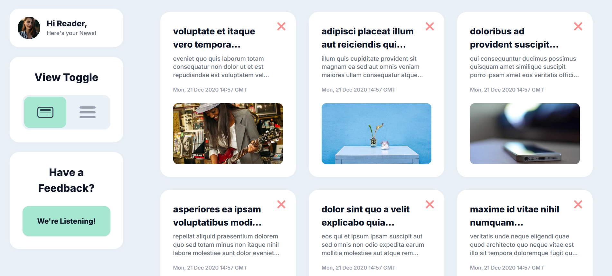

# 🗞️ News Aggregator & Feedback Clone

[](https://reactjs.org/)
[](https://vitejs.dev/)
[](https://tailwindcss.com/)
[](https://redux-toolkit.js.org/)

A premium, pixel-perfect React application that serves as a news aggregator with built-in feedback capabilities. Built with speed, aesthetics, and clean code principles in mind.



---

## 🚀 Quick Start

### Prerequisites
*   **Node.js** (v18 or higher)
*   **npm** or **yarn**

### Installation

1. **Clone the repository**
   ```bash
   git clone https://github.com/geekykalpesh/CodesForTmw.git
   cd CodesForTmw
   ```

2. **Install dependencies**
   ```bash
   npm install
   ```

3. **Run in development mode**
   ```bash
   npm run dev
   ```

4. **Build for production**
   ```bash
   npm run build
   ```

---

## 🎯 Core Features

-   **⏱️ Delayed Startup**: Simulated 5-second loading state for a realistic experience.
-   **📡 Live Data**: Fetches real news/post data from external API (JSONPlaceholder).
-   **📑 Smart Pagination**: Displays exactly 6 cards per page with intuitive navigation.
-   **🗑️ Dynamic Removal**: Removing a card automatically shifts the next one up to maintain the layout.
-   **🔄 View Toggle**: Seamlessly switch between **Grid** and **List** views.
-   **📝 Validated Feedback**: Professional feedback form with real-time field validation via Zod.
-   **✨ Premium UI**: Smooth animations with Framer Motion and modern styling with Tailwind CSS.

---

## 📂 Documentation

For a deep dive into how everything works, explore the `docs` folder:

*   [**📁 Folder Structure**](./docs/folder-structure.md) - Understand how the code is organized.
*   [**🛠️ Technical Stack**](./docs/technical-stack.md) - Details on libraries and tools used.
*   [**✨ Features & Logic**](./docs/features-implementation.md) - Technical explanation of core functionalities.
*   [**🎨 Design System**](./docs/design-system.md) - Colors, typography, and spacing.

---

## 🛠️ Tech Highlights

| Tech | Usage |
| :--- | :--- |
| **React 19** | Modern UI components |
| **Redux Toolkit** | Global State Management |
| **Tailwind CSS 4** | Ultra-modern styling |
| **Framer Motion** | Physics-based animations |
| **React Hook Form** | Performant form handling |
| **Zod** | Schema-based validation |
| **Axios** | API request handling |

---

## 👨‍💻 Codes For Tmw

*Created as a technical assessment for [Interview Target]. Implementation focused on pixel-perfect UI and clean, scalable architecture.*